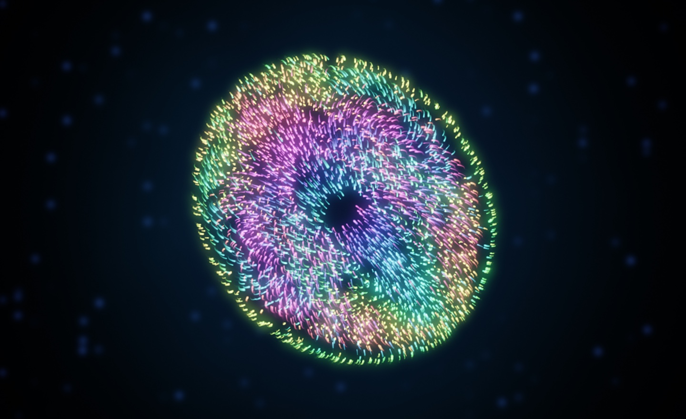
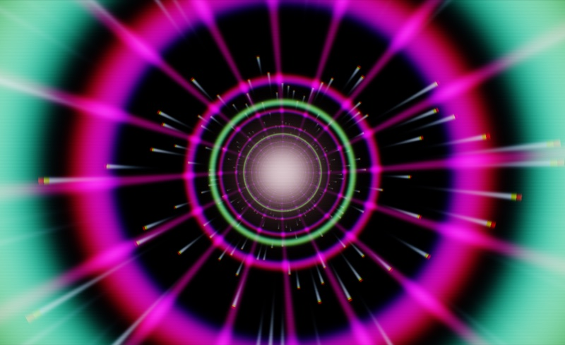
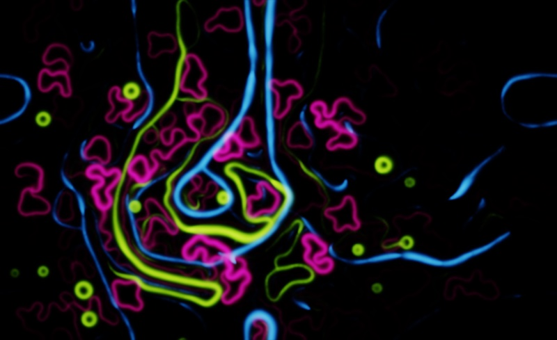
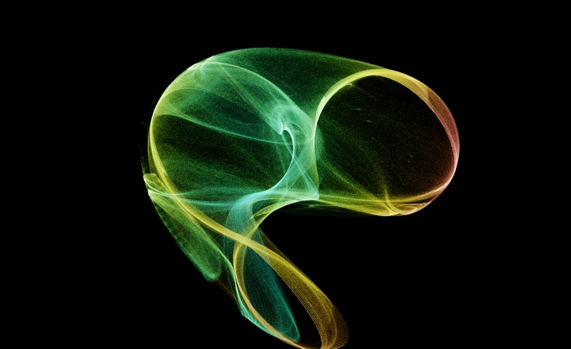
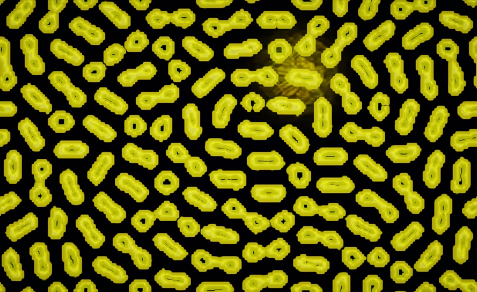
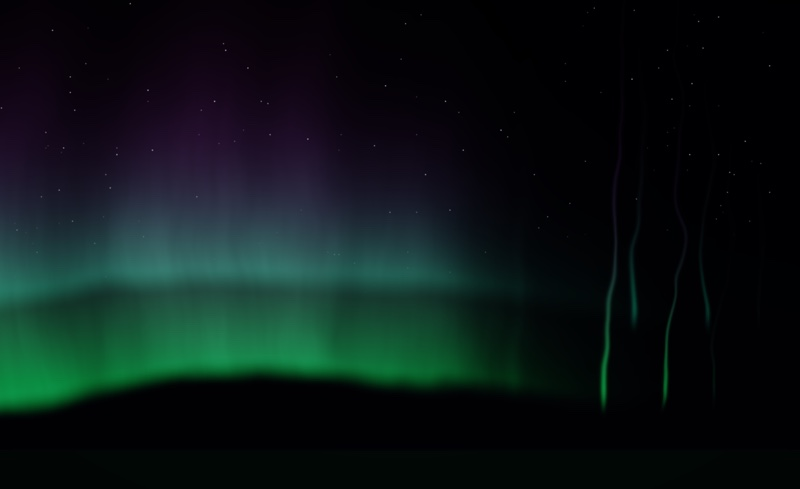
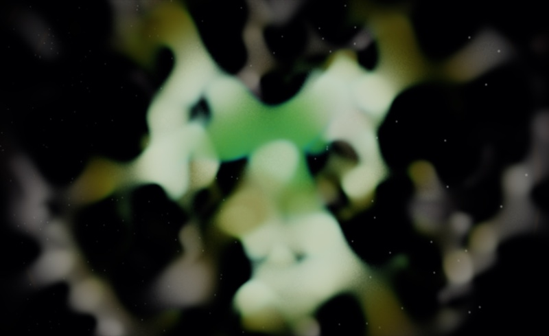

# ORPHIC — audio-reactive generative visualizer

<p align="center">
  
</p>

Sixteen GPU pattern simulations that react live to **whatever's playing**
(Spotify, YouTube, anything), with automatic speech-vs-music detection that
re-tunes the visuals for voice. Runs two ways: as a desktop app (Electron)
that captures **everything playing on the machine** natively, or as a
zero-dependency web page. Until capture starts, the landing screen plays an
idle attract mode — a real scene breathing to a gentle synthetic groove.

## Gallery

<table>
  <tr>
    <td width="33%"><br><sub><b>hyperdrive</b> · neon tunnel</sub></td>
    <td width="33%"><br><sub><b>physarum</b> · living network</sub></td>
    <td width="33%"><br><sub><b>chaos cathedral</b> · de jong attractor</sub></td>
  </tr>
  <tr>
    <td width="33%"><br><sub><b>lenia</b> · alien garden</sub></td>
    <td width="33%"><br><sub><b>aurora veil</b> · spectral curtains</sub></td>
    <td width="33%"><br><sub><b>stellar nursery</b> · ember nebula</sub></td>
  </tr>
</table>

<sub>Six of seventeen scenes, captured live to a synthetic groove. The full set is in the in-app pattern panel (press <code>s</code>).</sub>

## Run it — web

Just open `index.html` in Chrome or Edge (double-click works — no server, no
build, no dependencies) and hit **capture system audio**: share a tab and tick
"Share tab audio" in the picker. (Firefox/Safari never return tab audio from
the share picker — use the desktop app there.)

## Run it — desktop (Electron)

The desktop shell captures true whole-system audio with no picker, no virtual
drivers and no extra dependencies, via Chromium's OS loopback capture
(`setDisplayMediaRequestHandler` + `audio: 'loopback'`):

| platform | backend | requirement |
|---|---|---|
| Windows 10/11 | WASAPI loopback | none |
| macOS | CoreAudio process taps | **macOS 14.2 (Sonoma) or later** — the app refuses to launch on anything older (process taps don't exist there, capture would be permanently silent); one-time "System Audio Recording" consent |

Linux isn't officially supported right now — there's no packaged build and it's
untested — but the code paths are all there (PulseAudio/PipeWire loopback
behind an auto-set feature flag, MPRIS transport) and it should work from
`npm run dev`.

```sh
npm install
npm run dev          # develop (renderer is static — reload with Cmd/Ctrl+R)
npm run test:smoke   # build + run the all-scenes self-test inside Electron
npm run dist:mac     # package (also: dist:win)
```

The same `js/` + `css/` + `index.html` power both targets — the renderer
feature-checks `window.orphic` (exposed by the preload bridge) to decide
between native loopback and the browser tab-share picker. The TypeScript
main/preload processes live in `src/`, built by electron-vite; packaging is
electron-builder (`electron-builder.yml`, hardened with Electron fuses, the
renderer served over a CSP'd custom `orphic://` scheme, sandbox + context
isolation on).

macOS note: if capture starts but stays silent, the one-time system-audio
consent was declined — re-enable it in System Settings → Privacy & Security
(the app shows a hint when this happens, a known Chromium behavior where the
stream goes dead silently instead of erroring, electron/electron#49607).

### Signing & distribution

Packaged builds are currently unsigned: macOS Gatekeeper shows an
"unidentified developer" warning and Windows SmartScreen an "unknown
publisher" one. To sign:

- **macOS** — join the Apple Developer Program ($99/yr), create a
  *Developer ID Application* certificate, then set `CSC_NAME` (or
  `CSC_LINK`/`CSC_KEY_PASSWORD`) and notarization credentials
  (`APPLE_ID`, `APPLE_APP_SPECIFIC_PASSWORD`, `APPLE_TEAM_ID`) in the
  environment — electron-builder signs and notarizes automatically when
  they're present.
- **Windows** — buy a code-signing certificate (OV ≈ $100–300/yr; EV removes
  the SmartScreen warning immediately, OV only after reputation builds), then
  point electron-builder at it via `win.signtoolOptions` or the
  `CSC_LINK`/`CSC_KEY_PASSWORD` env vars. Azure Trusted Signing is the
  cheaper modern alternative (~$10/mo).

### Controls

The HUD (wakes on mouse move): scene pill with pattern number + auto-cycle
progress (click it for the full pattern panel), live BPM with a beat-pulsing
dot, music/speech/ambient badge, auto-cycle toggle, fullscreen, and a stop
button back to the landing screen. In the desktop app a centered transport
cluster (previous · play/pause · next) drives whatever the OS is playing —
Spotify/Music on macOS, media keys on Windows, MPRIS on Linux.

| key | action |
|---|---|
| `space` / `enter` | landing: start capture · panel: select the highlighted pattern |
| `space` | playing: skip to the next pattern |
| `s` / click the scene pill | pattern panel — all sixteen; arrows navigate the grid, click or enter to pick |
| `←` `→` | previous / next pattern (in the panel: move across the grid) |
| `↑` `↓` | move up / down the pattern grid (panel open) |
| `a` | toggle auto-cycle (switches pattern every ~45 s, on a beat) |
| `f` / double-click | fullscreen |
| `k` | play / pause the system player (desktop app) |
| `j` / `l` | previous / next track (desktop app) |
| `esc` | close the panel — or, while playing, stop capture back to the landing |

## The sixteen patterns

| # | scene | system | reacts how |
|---|---|---|---|
| 1 | **physarum · living network** | Jeff Jones (2010) slime-mold agents, 262k on GPU, 3 competing species | band-per-species: bass species is slow/heavy with long sensors, mid balanced, treble fast filigree — each only thrives while its band plays, so the mix decides territory; onsets scatter the treble species, beats pull the bass one inward |
| 2 | **ink nebula · stable fluids** | Jos Stam (1999) fluids + vorticity confinement | beats fire ink-jet rings, onsets side jets, treble adds swirl, speech rides pitch |
| 3 | **turing bloom · reaction-diffusion** | Gray-Scott (Pearson 1993), drifts between mitosis/worms/coral regimes | bass → feed rate, centroid → kill rate, beats stamp seeds on a golden-angle ring |
| 4 | **star river · curl-noise flow** | Bridson (2007) divergence-free curl noise, 262k particles | centroid → turbulence scale, bass → flow speed, onsets detonate respawn rings |
| 5 | **lenia · alien garden** | Bert Chan's continuous cellular automaton (2019) | bass shifts growth optimum, level speeds time, beats sow organisms |
| 6 | **chladni resonance · cymatics** | Chladni plate eigenmodes, three superimposed pairs | mode pairs weighted by bass/mid/treble; beats re-strike the plate |
| 7 | **chaos cathedral · de jong attractor** | Peter de Jong map, 262k iterated particles | beat-synced morphing between known-good parameter sets, bass breathes the camera |
| 8 | **hyperdrive · neon tunnel** | demoscene polar tunnel, synthwave dress | speed rides the loudness phase accumulator, beats launch rings, kick → chromatic aberration |
| 9 | **obsidian sanctum · mandelbox** | raymarched Mandelbox (Lowe 2010), orbit traps | bass refolds the fractal's topology, mids twist the box fold, the live spectrum lights it by altitude (bass = base, treble = spires), palette follows the musical key |
| 10 | **spectral canyon · spectrogram terrain** | raymarched heightfield over the scrolling spectrogram | the landscape IS the spectrum: lateral = log frequency, depth = time — every sound erupts at the horizon and rides toward you; horizon carries a live EQ aurora |
| 11 | **harmony bloom · chroma mandala** | 12-petal flower + roto-zoom feedback echo | each petal is a pitch class sized by its energy (chords are visible shapes), petal hues sit on the circle of fifths, interior rings are a bass→treble frequency ladder, beats step the rotation |
| 12 | **aurora veil · spectral curtains** | night-sky aurora whose curtains are the equalizer | horizontal position = log frequency (bass curtains left, treble wisps right), curtain brightness/height = that band's peak-decay envelope (temporally smooth — breathes, never strobes), kicks ripple the veil, harmonic content raises it; rests fade it to one faint arc, the return floods the sky |
| 13 | **murmuration · dusk flock** | 65k field-coupled boids (no neighbor lists: a 128² velocity/density field drives alignment/cohesion/separation) | kicks flare separation so the cloud bursts and regroups, mids tighten formation, onsets launch a hawk through the flock, and every bird is keyed to one spectrum slice — its band's energy agitates it |
| 14 | **escher gate · hyperbolic tiling** | {p,q} Poincaré-disk tiling via (p,q,2) triangle-group folds | glides through hyperbolic space on loudness (rests freeze it to embers), re-tessellates every 8 beats or when music returns, tiling depth tiers lit per-frequency (bass = heart, treble = infinite rim), harmonic content thickens the lattice, percussive hits flash the vertices |
| 15 | **stellar nursery · ember nebula** | raymarched volumetric gyroid gas, emission/absorption | beats detonate shockwave shells through the gas, percussive energy flares the core star, harmonic content makes the gas glow, radius shells lit per-frequency; rests thin it to a dim ember and pull the camera away — the return is a supernova |
| 16 | **voice aurora · pitch contour** | live pitch tracking drawn as flowing arcs | speech-only scene: ribbon rides your pitch, sibilance shadows above, consonants spark |

## How it listens

- 4096-bin FFT (Web Audio `AnalyserNode`) → band energies with asymmetric
  attack/release envelopes, AGC-normalized level, spectral centroid / flatness /
  rolloff, half-wave-rectified spectral flux
- onsets via adaptive threshold (mean + 1.6 σ over ~4 s of flux history)
- tempo via autocorrelation of the onset-strength signal; beat phase re-anchors
  on strong onsets and coasts through silent gaps
- pitch via NSDF-style autocorrelation (80–1000 Hz)
- HPSS (Fitzgerald 2010 median-filter proxy): time-median of the spectrogram
  ≈ harmonic (sustained) energy, frequency-median ≈ percussive (transient)
  energy — so scenes can tell chords from drum hits
- rests: a `quiet` envelope rises ~0.6 s into silence and snaps away on
  sound; `burst` spikes when music returns after a real rest — scenes freeze,
  dim or collapse during rests and detonate on the return
- chroma: per-bin energy folded into 12 pitch classes (55 Hz–5 kHz); scenes
  derive a "key hue" from its circular mean on the circle of fifths, so
  consonant harmony lands on related colors
- per-frequency GPU access: the raw FFT and waveform are uploaded as 1D
  textures every frame, plus a scrolling 512×256 spectrogram history target
  (log-frequency rows + peak-decay envelope) — scenes sample these via the
  shared `spec()` / `specLog()` / `wave()` GLSL helpers, so individual
  frequencies (not just band scalars) can drive structure
- **phase accumulators** — loudness counters that advance faster when the music
  is louder — drive all slow scene motion (no per-frame amplitude jitter)
- speech vs music: syllabic-rate (≈4 Hz) energy modulation, pause ratio,
  voiced/unvoiced alternation, beat confidence — smoothed with hysteresis; the
  HUD badge shows the current decision and scenes re-tune accordingly

Design choices follow the verified findings of a deep research pass (June 2026):
Gray-Scott F/k as the ideal two-scalar audio target (Munafo's xmorphia map),
Lenia for stability under live perturbation (Plantec et al. 2023), envelope-
smoothed + AGC-normalized mappings and phase accumulators over raw values
(Listeningway, Graf-Opara-Barthet 2021 user study), event triggers for beats
and onsets (Patin's 1.3× energy rule lineage), and the IEEE/ACM TASLP 2020
finding that speech traces smooth arcs in time-frequency space — which scene 9
renders literally.

## Developer notes

- WebGL2, classic scripts (no modules) so `file://` works; RGBA16F ping-pong
  buffers via `EXT_color_buffer_float` (graceful RGBA8 fallback)
- `index.html#test` — headless self-test: builds, steps and renders every scene
  once, logs `SCENE OK/FAIL` per scene
- `index.html#shot-N` — drives scene N with synthetic audio (600 sim frames)
  for screenshots
- `index.html#ui` — HUD + pattern panel forced visible over the idle scene,
  for styling work

## License

ORPHIC is dual-licensed.

**By default it's free software** under the
[GNU Affero General Public License v3.0 or later](LICENSE) (AGPL-3.0-or-later).
You may use, run, study, modify, and redistribute it under those terms —
including commercially, such as running it at paid events, installations, or
performances. Because it's the *Affero* GPL, if you redistribute it, build it
into a larger work, or run a modified version as a network service, you must
release that work's complete source under the AGPL too, keeping the existing
copyright and license notices intact (please credit ORPHIC / Aditya
Rajashekaran).

**For closed-source / proprietary use** — e.g. embedding ORPHIC's code inside a
proprietary music program or product — the AGPL won't fit, and you'll need a
separate commercial license. See [COMMERCIAL-LICENSE.md](COMMERCIAL-LICENSE.md);
terms are available on request via <https://github.com/soulaflare/orphic>.

Copyright © 2026 Aditya Rajashekaran.
